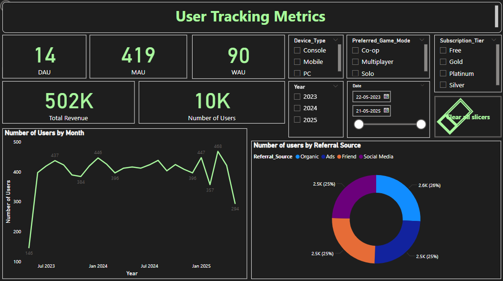
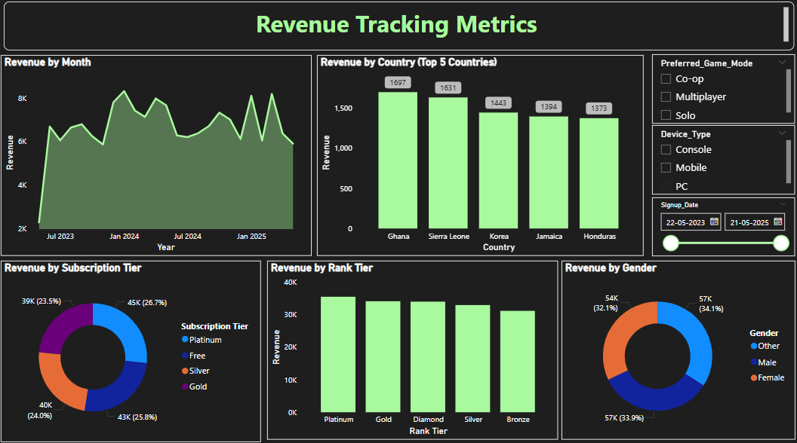
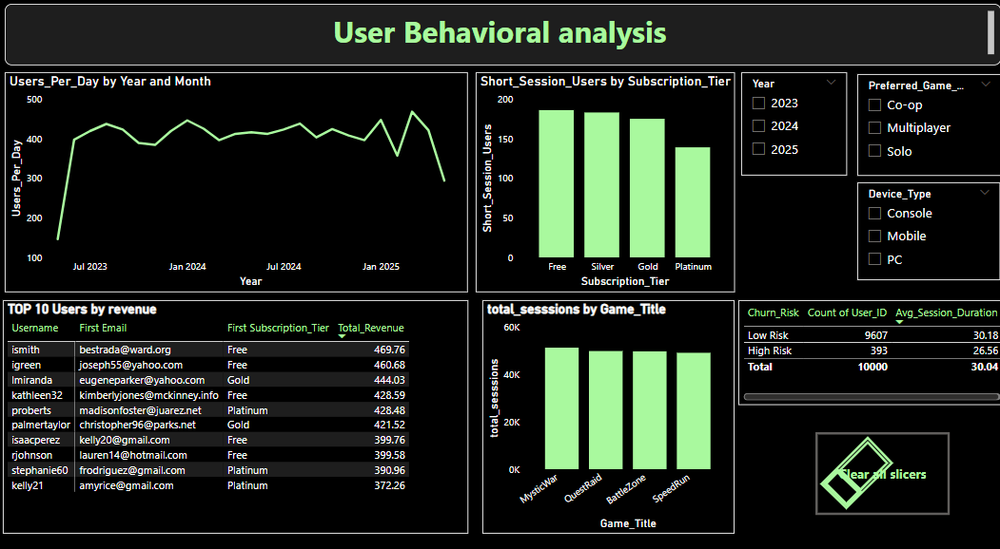
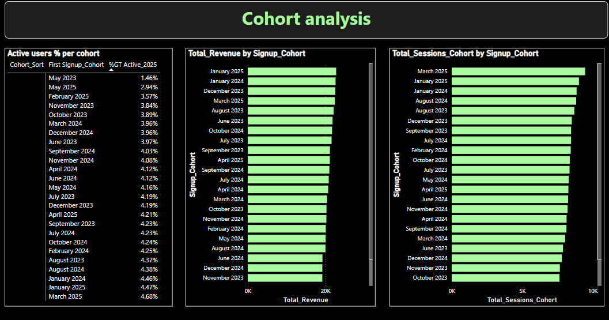

# 📊 Power BI Dashboard Project

This repository contains a set of Power BI dashboards analyzing user behavior, segmentation, revenue trends, and funnel performance. It also includes supporting files like a sample dataset and business problem statement.

---

## 🧾 Project Overview

This project demonstrates the use of **Power BI** to analyze product usage and user metrics. The dashboards provide insights into:

- User behavior over time
- Cohort retention and engagement
- Funnel drop-off rates
- Revenue trends
- Segmentation of user types
- Tracker metrics for user lifecycle

---

## 📁 Files Included

| File Name                    | Description                                |
|-----------------------------|--------------------------------------------|
| `PowerBI.pbix`              | Main Power BI dashboard file               |
| `Dataset-ssample.xlsx`      | Sample dataset used in the dashboard       |
| `Problem statement.pdf`     | Business context and problem description   |
| `INSIGHTS REPORT_Onkar_...` | Summary of key findings (PDF/Doc)          |
| `*.jpeg` files              | Screenshots of each dashboard view         |

---

## 📸 Dashboard Screenshots

### 📍 User Tracker

### 💸 Revenue Trends

### 🧠 Behavior Analysis

### 👥 User Segmentation & 🔻 Funnel Analysis
![User Segmentation]M_User_Segmentation_Funnel_analysis.png)

### 📆 Cohort Analysis

---

## 🧠 How to Use

To open or interact with the dashboard:

1. Download `PowerBI.pbix`.
2. Open it with [Power BI Desktop](https://powerbi.microsoft.com/desktop/).
3. Load the sample data (`Dataset-ssample.xlsx`) if prompted.
4. Explore different tabs to view the dashboards.

---

## 📬 Contact

For questions or collaboration, feel free to reach out via GitHub or LinkedIn.

---
